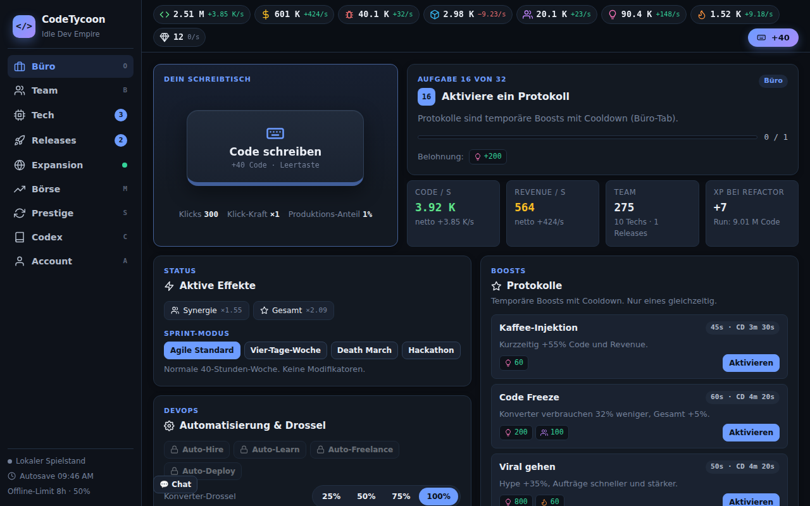
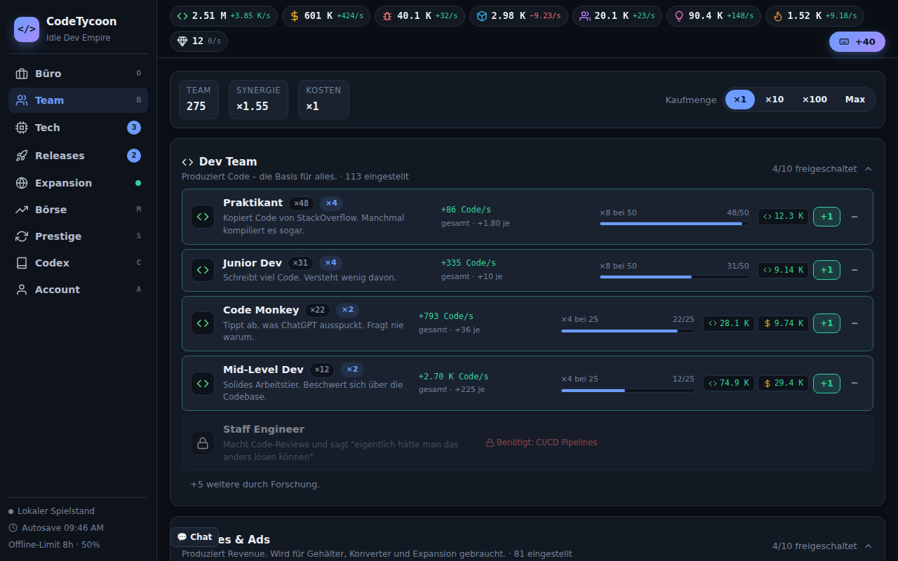
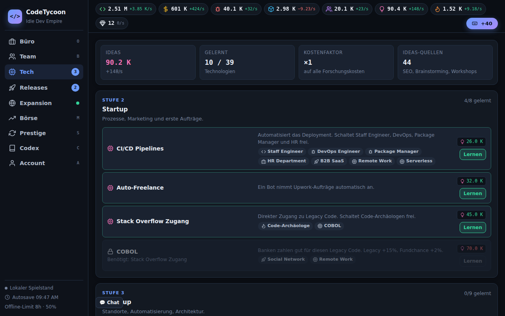
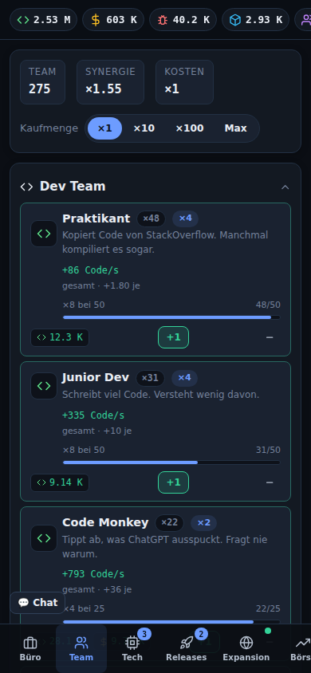

# CodeTycoon

**Baue dein Tech-Imperium — vom Praktikanten bis zur AGI.**

Ein browserbasiertes Idle-/Incremental-Game mit Startup-Thematik, Cloud-Save, globalem Leaderboard und tiefem Progression-System.

**[► Jetzt spielen auf game.fersd.com](https://game.fersd.com)**

---

## Screenshots

| Büro (Klicker, Aufgabe, KPIs) | Team (kompakte Zeilen, Meilensteine) |
|---|---|
|  |  |

| Tech (5 Stufen, Freischaltungen) | Mobile |
|---|---|
|  |  |

## Was ist neu (Rework)

- **Neues UI**: Sidebar (Desktop) bzw. Bottom-Navigation (Mobile), Ressourcenleiste mit Live-Raten, kompakte Zeilen statt Riesenkarten, Tooltips überall.
- **Klarer Einstieg**: Der Klick-Button steht oben im Büro-Tab, 32 sequenzielle **Aufgaben** führen vom ersten Klick bis zur AGI und geben Belohnungen.
- **Echte Wirtschaft**: Konverter verbrauchen wirklich Vorrat und laufen gedrosselt, wenn Input fehlt – kein verstecktes "Netto auf 0 kappen" mehr.
- **Meilensteine**: Bei 10 / 25 / 50 / 100 / 200 / 300 / 400 / 500 Stück verdoppelt sich der Output eines Gebäudes. Der Fortschritt dahin ist in jeder Zeile sichtbar.
- **Neue Balance**: Glatte Kostenkurve (×1.15 pro Kauf, ~×10 pro Stufe), 5 Tech-Stufen, Prestige-XP nach Kubikwurzel, erstes Prestige lohnt sich nach ~1,5–2 h aktivem Spiel.
- **Komfort**: Kaufmenge ×1/×10/×100/Max (Tasten 1–4), "leistbar in Xs"-Anzeige, Badges in der Navigation, wenn etwas kaufbar ist, Export/Import des Spielstands.

## Features

### Kernloop
- Code schreiben (Klick / Leertaste) → Praktikanten einstellen → Google Ads für Revenue → SEO-Experten für Ideas → Technologien lernen → bessere Mitarbeiter.
- **Idle**: Produktion läuft weiter, Offline-Fortschritt bis zum Offline-Limit (Standard 8 h, 50 % Effizienz – beides per Chronicle ausbaubar).
- **Autosave** lokal, optional Cloud-Sync.

### Ressourcen (8)
| ID | Anzeige | Herkunft / Zweck |
|----|---------|------------------|
| `scrap` | Code | Dev-Team. Hauptwährung. |
| `energy` | Revenue | Sales & Ads. Zweite Währung, füttert Konverter. |
| `alloy` | Bugs | QA-Konverter aus Code. Baumaterial. |
| `components` | Module | NPM Install aus Bugs. Für Growth, Releases, Standorte. |
| `data` | Users | SEO / Growth Hacker. Für Brainstorming und Archäologen. |
| `research` | Ideas | SEO, Brainstorming, Workshops. Kauft Technologien. |
| `influence` | Hype | Tech Blogger & Co. Für Standorte und große Releases. |
| `relics` | Legacy Code | Archäologen und Aufträge. Selten, für Endgame-Releases. |

### Team (42 Gebäude, 6 Kategorien)
- **Producer** (Dev Team, Sales & Ads) erzeugen Code bzw. Revenue.
- **Konverter** (QA & DevOps, Marketing & R&D, Social Media) wandeln Ressourcen um und verbrauchen dabei echten Vorrat.
- **Modifier** (Management) geben passive Boni (wirken bis 20 Stück).

### Technologien (39, 5 Stufen)
Garage → Startup → Scale-up → Konzern → Singularität. Jede Tech zeigt direkt, was sie freischaltet. Einige sind Entweder/Oder (Open Source vs. Enterprise).

### Releases (10) & Funde (12)
Einmalige Megaprojekte mit permanentem Effekt im Run (ToDo App bis Internet 3.0). Funde sind seltene Drops aus Aufträgen und bleiben für immer.

### Expansion
- **Freelance-Aufträge**: 9 Aufträge (5 min – 3 h), Belohnung skaliert mit deiner Produktion, Chance auf Funde und Mainframe-Chips, Agentur-Level.
- **Standorte**: bis zu 8 Büros in 6 Städten mit eigenen Boni, 6 Fokus-Einstellungen, 15 Ausbaustufen.
- **Core Values**: eine Doktrin pro Run.

### Büro-Tab
Klick-Button, aktuelle Aufgabe, KPIs, aktive Effekte, Sprint-Modus (4 Modi), Protokolle (4 temporäre Boosts mit Cooldown), Automatisierung, Konverter-Drossel, Ressourcenfluss-Tabelle, Log.

### Prestige (Hard Refactor)
XP = 6 · ∛(Code im Run / 10 Mio.) · Struktur-Bonus. Erhalten bleiben Funde, Chips, Errungenschaften, Chronicle-Upgrades (11), Meilensteine (12), Aufgaben-Fortschritt, Aktien-Depot. Mainframe-Chips (10) mit Tradeoffs.

### Ereignisse
Zufallsereignisse, interaktive Cyber-Events (Ransomware, DDoS, Investor Call …) und der herumfliegende Bug 🐛 mit Sofort-Bonus.

### Börse
Serverbasierter Aktienmarkt (alle Spieler sehen dieselben Kurse). Jede Aktie erhöht die Produktion ihrer Ressource um 0,01 % (max. +50 % je Ressource).

### Cloud & Community
JWT-Login, Cloud-Save mit Konfliktauflösung, Leaderboard, Profile, globaler Chat mit Befehlen.

### Tastatur
`Leertaste` Code schreiben · `O B R P E M S C A` Tabs · `1 2 3 4` Kaufmenge · `Esc` Modal schließen

---

## Tech Stack

| Schicht | Technologie |
|---------|-------------|
| Frontend | [SolidJS](https://www.solidjs.com/) + [Vite](https://vitejs.dev/) |
| Backend | [Express.js](https://expressjs.com/) + SQLite3 |
| Auth | JWT (jsonwebtoken + bcryptjs) |
| Deployment | Docker (Multi-Stage-Build) |
| Sprache | Deutsch (UI) · JavaScript (ESM) |

### Projektstruktur
```
├── src/
│   ├── components/
│   │   ├── App.jsx          # App-Shell, Game Loop, Modal/Toast/Tooltip, Action-Dispatcher
│   │   └── renderers.js     # HTML-Renderer für Navigation, Topbar und alle Tabs
│   ├── engine/
│   │   ├── tick.js          # Simulationsschritt
│   │   ├── actions.js       # Spieler-Aktionen
│   │   ├── automation.js    # Auto-Hire / Learn / Freelance / Deploy
│   │   ├── quests.js        # Aufgaben-System
│   │   ├── events.js        # Aufträge, Ereignisse, Errungenschaften, Meilensteine
│   │   ├── cyberEvents.js   # Interaktive Events
│   │   ├── stocks.js        # Börse (Client)
│   │   └── themeEngine.js   # Akzent-Theme nach Fortschritt
│   ├── store/
│   │   ├── gameState.js     # Zentraler Store, Save/Load/Migration
│   │   └── bonuses.js       # Bonus-Berechnung + Produktionsmodell
│   ├── data/                # Statische Spielinhalte (buildings, techs, projects, quests, ...)
│   ├── lib/                 # api-client, format, icons, sanitize, toast
│   └── index.css            # Design-System
└── backend/
    ├── server.js
    ├── db.js
    ├── lib/                 # stockMarket, profanityFilter
    └── routes/              # auth, game, chat, stocks
```

---

## Lokal starten

**Voraussetzungen:** Node.js 18+

```bash
npm install
cd backend && npm install && cd ..
cp .env.example .env
npm run dev          # Frontend :5173, Backend :3005
```

### Nur Frontend
```bash
npm run dev          # Kein Login, kein Cloud-Save – alles lokal im Browser
```

### Production Build
```bash
npm run build        # dist/ erstellen
cd backend && npm start   # Backend serviert dist/ auf :3005
```

### Docker
```bash
docker build -t codetycoon .
docker run -p 3005:3005 codetycoon
```

## Umgebungsvariablen

| Variable | Default | Beschreibung |
|----------|---------|-------------|
| `VITE_API_BASE_URL` | `http://localhost:3005/api` | API-Basis-URL für das Frontend |
| `VITE_API_TIMEOUT_MS` | `10000` | Request-Timeout in ms |
| `JWT_SECRET` | `change_me` | Geheimnis für JWT-Signierung |
| `PORT` | `3005` | Backend-Port |
| `ADMIN_USERNAME` | — | Benutzername mit Admin-Rechten |
| `ALLOWED_ORIGIN` | — | CORS-Origin in Produktion |

## Lizenz

ISC
