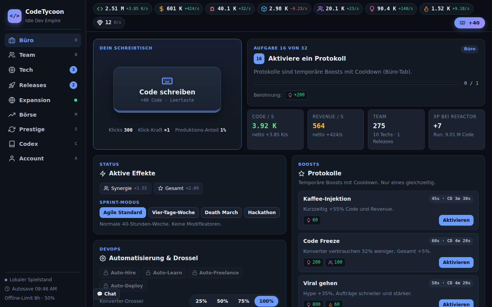
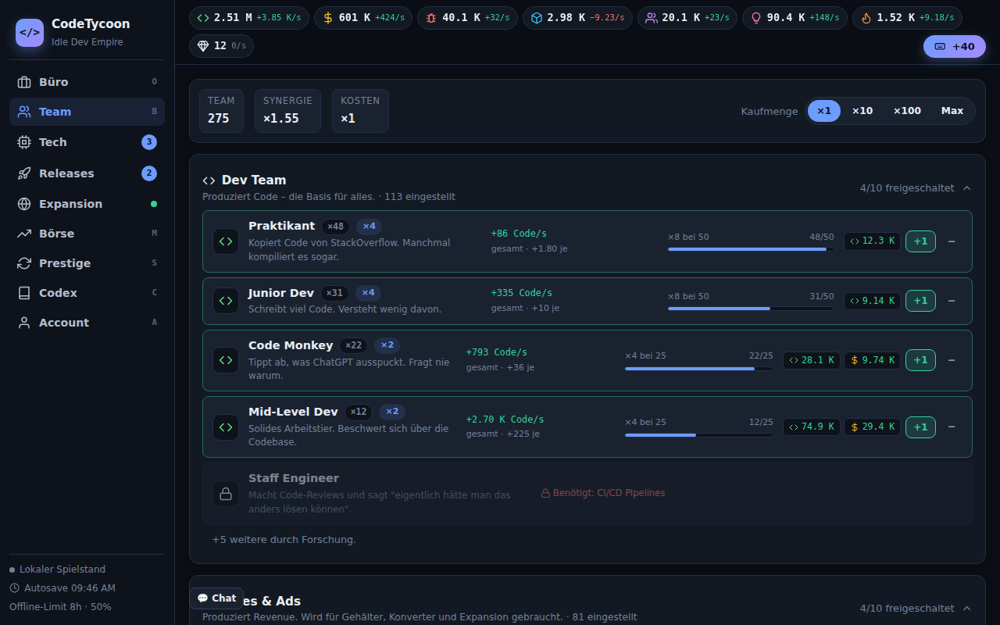
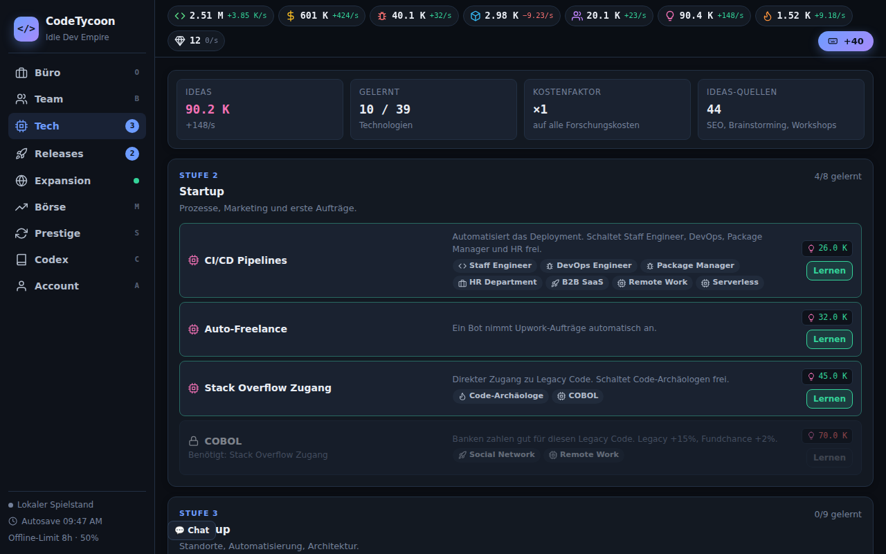
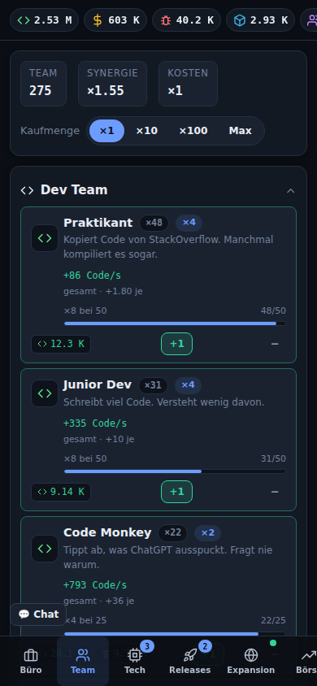
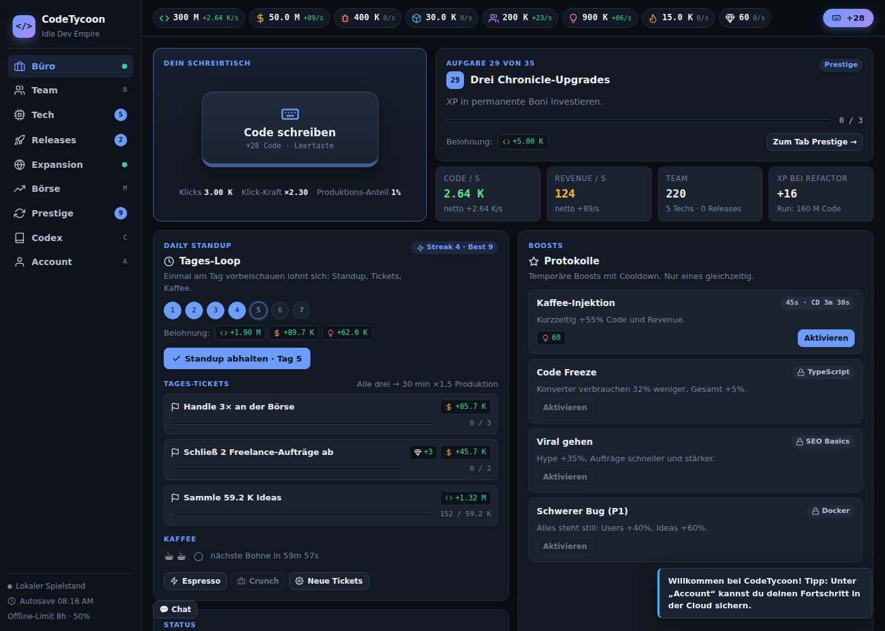
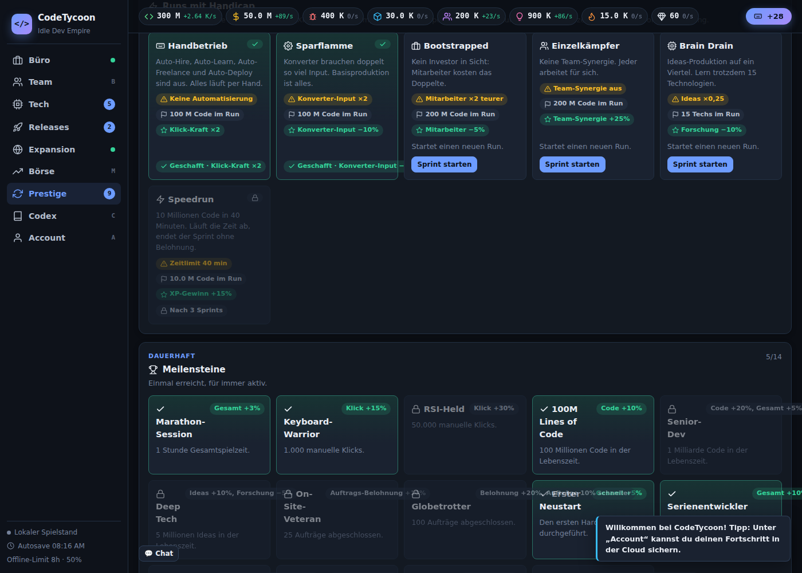

# CodeTycoon

**Baue dein Tech-Imperium — vom Praktikanten bis zur AGI.**

Ein browserbasiertes Idle-/Incremental-Game mit Startup-Thematik, Cloud-Save, globalem Leaderboard und tiefem Progression-System.

**[► Jetzt spielen auf game.fersd.com](https://game.fersd.com)**

---

## Screenshots

| Büro (Klicker, Aufgabe, KPIs) | Team (kompakte Zeilen, Meilensteine) |
|---|---|
|  |  |

| Tech (5 Stufen, Freischaltungen) | Mobile |
|---|---|
|  |  |

| Tages-Loop (Standup, Tickets, Kaffee) | Sprints (Runs mit Handicap) |
|---|---|
|  |  |

## Was ist neu (Rework)

- **Neues UI**: Sidebar (Desktop) bzw. Bottom-Navigation (Mobile), Ressourcenleiste mit Live-Raten, kompakte Zeilen statt Riesenkarten, Tooltips überall.
- **Klarer Einstieg**: Der Klick-Button steht oben im Büro-Tab, 35 sequenzielle **Aufgaben** führen vom ersten Klick bis zur AGI und geben Belohnungen.
- **Echte Wirtschaft**: Konverter verbrauchen wirklich Vorrat und laufen gedrosselt, wenn Input fehlt – kein verstecktes "Netto auf 0 kappen" mehr.
- **Meilensteine**: Bei 10 / 25 / 50 / 100 / 200 / 300 / 400 / 500 Stück verdoppelt sich der Output eines Gebäudes. Der Fortschritt dahin ist in jeder Zeile sichtbar.
- **Neue Balance**: Glatte Kostenkurve (×1.15 pro Kauf, ~×10 pro Stufe), 5 Tech-Stufen, Prestige-XP nach Kubikwurzel, erstes Prestige lohnt sich nach ~1,5–2 h aktivem Spiel.
- **Komfort**: Kaufmenge ×1/×10/×100/Max (Tasten 1–4), "leistbar in Xs"-Anzeige, Badges in der Navigation, wenn etwas kaufbar ist, Export/Import des Spielstands.
- **Tages-Loop**: Daily Standup mit Streak (Tag 7 = großer Bonus), drei Tages-Tickets mit Belohnung (alle drei → 30 min ×1,5), Kaffee reift alle 6 h in Echtzeit (Espresso ×2, Crunch, neue Tickets).
- **Sprints**: Ab dem ersten Refactor sechs Runs mit Handicap (Handbetrieb, Sparflamme, Bootstrapped, Einzelkämpfer, Brain Drain, Speedrun). Ziel erreicht → permanenter Bonus.

## Features

### Kernloop
- Code schreiben (Klick / Leertaste) → Praktikanten einstellen → Google Ads für Revenue → SEO-Experten für Ideas → Technologien lernen → bessere Mitarbeiter.
- **Idle**: Produktion läuft weiter, Offline-Fortschritt bis zum Offline-Limit (Standard 12 h, 50 % Effizienz – beides per Chronicle ausbaubar).
- **Autosave** lokal, optional Cloud-Sync.

### Ressourcen (8)
| ID | Anzeige | Herkunft / Zweck |
|----|---------|------------------|
| `scrap` | Code | Dev-Team. Hauptwährung. |
| `energy` | Revenue | Sales & Ads. Zweite Währung, füttert Konverter. |
| `alloy` | Bugs | QA-Konverter aus Code. Baumaterial. |
| `components` | Module | NPM Install aus Bugs. Für Growth, Releases, Standorte. |
| `data` | Users | SEO / Growth Hacker. Für Brainstorming und Archäologen. |
| `research` | Ideas | SEO, Brainstorming, Workshops. Kauft Technologien. |
| `influence` | Hype | Tech Blogger & Co. Für Standorte und große Releases. |
| `relics` | Legacy Code | Archäologen und Aufträge. Selten, für Endgame-Releases. |

### Team (46 Gebäude, 6 Kategorien)
- **Producer** (Dev Team, Sales & Ads) erzeugen Code bzw. Revenue.
- **Konverter** (QA & DevOps, Marketing & R&D, Social Media) wandeln Ressourcen um und verbrauchen dabei echten Vorrat.
- **Modifier** (Management) geben passive Boni (wirken bis 20 Stück).

### Technologien (39, 5 Stufen)
Garage → Startup → Scale-up → Konzern → Singularität. Jede Tech zeigt direkt, was sie freischaltet. Einige sind Entweder/Oder (Open Source vs. Enterprise).

### Releases (10) & Funde (12)
Einmalige Megaprojekte mit permanentem Effekt im Run (ToDo App bis Internet 3.0). Funde sind seltene Drops aus Aufträgen und bleiben für immer.

### Expansion
- **Freelance-Aufträge**: 9 Aufträge (5 min – 3 h), Belohnung skaliert mit deiner Produktion, Chance auf Funde und Mainframe-Chips, Agentur-Level.
- **Standorte**: bis zu 8 Büros in 6 Städten mit eigenen Boni, 6 Fokus-Einstellungen, 15 Ausbaustufen.
- **Core Values**: eine Doktrin pro Run.

### Büro-Tab
Klick-Button, aktuelle Aufgabe, KPIs, Tages-Loop (Daily Standup, Tickets, Kaffee), aktive Effekte, Arbeitsmodus (4 Modi), Protokolle (4 temporäre Boosts mit Cooldown), Automatisierung, Konverter-Drossel, Ressourcenfluss-Tabelle, Log.

### Tages-Loop & Sprints
- **Daily Standup**: einmal pro Tag im Büro abholen – Minuten deiner aktuellen Produktion, steigend mit der Streak (5 → 30 min). Tag 7 gibt Legacy Code und einen ×2-Boost; ein verpasster Tag setzt die Streak zurück.
- **Tages-Tickets**: fünf Angebote pro Tag aus einem Pool von neun (Klicks, Einstellungen, Aufträge, Techs, Bugs …), jedes mit Belohnung (skaliert mit der Produktion). Die ersten drei erledigten → zusätzlich 30 min ×1,5.
- **Kaffee**: reift alle 6 h in Echtzeit (auch offline, max. 3). Espresso (×2 für 20 min), Crunch (laufende Aufträge sofort fertig), Überstunden (Labor −3 h) oder neue Tickets würfeln.
- **Boosts** (Tages-Bonus, Retro-Bonus, Espresso) laufen nacheinander: Kommt einer dazu, während ein anderer läuft, wartet er und startet danach – nach einer Abwesenheit erst beim Zurückkommen.
- **Desktop-Hinweise** (Account-Tab, optional): Labor fertig, Kaffee reif, neuer Tag (ab 8 Uhr) und Aufträge fertig, solange der Tab im Hintergrund offen ist.
- **Sprints** (Prestige-Tab, ab dem ersten Refactor): Runs mit Handicap und Ziel. Belohnungen sind permanent: Klick ×2, Konverter −10 % Input, Mitarbeiter −5 %, Team-Synergie +25 %, Forschung −10 %, XP +15 %.
- **Wochen-Sprint**: jede Woche ein neues Handicap-Paar, 30 Minuten; gewertet wird der Code bei Minute 30 gegen den eigenen Normalwert (bester Stand bei Minute 30 der letzten fünf normalen Runs). Beliebig oft, der beste Versuch zählt für die Wochenwertung.

### DevOps (Büro-Tab)
Die Automatisierung (Auto-Hire, Auto-Learn, Auto-Freelance, Auto-Deploy) bekommt Regeln, die je ein einmaliges Laborprojekt freischaltet:
- **Sparziel** (Release-Planung): 🎯 an einem Release oder einer Tech. Solange das Ziel weit weg ist, wächst die Firma normal weiter; ist es in 30 Minuten erreichbar, lassen automatische Käufe die Kosten liegen, und das Ziel wird gekauft, sobald es bezahlbar ist – auch offline und bei ausgeschalteten Schaltern (nicht in Sprints ohne Automatisierung, nie der Börsengang).
- **Reserven** (Budget-Policy): je Ressource 15 min, 1 h oder 4 h Produktion, die automatische Käufe immer liegen lassen. Manuelle Käufe sind frei.
- **Auftrags-Fokus** (Freelance-Matching, ab Seed): Auto-Freelance wählt den stärksten, kürzesten oder längsten Auftrag oder den mit dem meisten Legacy, Hype, Ideas bzw. Users pro Stunde.
- **Profile** (Config as Code, ab Seed): „Aufbau“ und „Sparen“ speichern Schalter, Reserven, Fokus, Arbeitsmodus und Drossel; ein Klick wechselt. Arbeitsmodus und Drossel überstehen dann auch den Refactor.

### Prestige (Hard Refactor)
XP = 6 · ∛(Code im Run / 10 Mio.) · Struktur-Bonus. Ein Refactor braucht mindestens 10 XP bzw. 2 % der bisher verdienten XP. Erhalten bleiben Funde, Chips, Errungenschaften, Chronicle-Upgrades (11), Meilensteine (14), Finanzierungsrunde, Aufgaben-Fortschritt, Daily-Streak, Kaffee und Sprint-Belohnungen. Mainframe-Chips (10) mit Tradeoffs.

### Finanzierungsrunden (Tab Roadmap)
Garage → Seed → Series A → Series B → Series C → IPO → Börsennotiert. Jede Runde schaltet Inhalte frei (Tech-Stufe 4 ab Seed, 5 ab Series A, Stufe 6 „Plattform“ ab Series B/C, neue Mitarbeiter und Releases bis zum Börsengang) und hat Ziele: verdiente XP, Sprints, Daily Standups, ein Release und das Schlüsselprojekt im Labor. Abgeschlossene Runden geben dauerhafte Boni (bis zu Gesamt ×2 je Runde, weitere Labor- und Chip-Slots). Ausgelegt auf 2–4 Wochen mit täglichem Reinschauen; der Börsengang ist das Finale.
- **Zwischenziel:** Bei halbem XP-Balken schaltet eine Runde die erste Tech der nächsten Stufe vorab frei (Seed: Venture Capital, Series A: Platform APIs, Series B: Quantum Computing) – jeweils mit einem neuen Mitarbeiter.
- **Prognose:** Der Roadmap-Tab schätzt aus dem XP-Tempo der letzten drei Tage (gemerkt bei jedem Refactor), wann Zwischenziel und XP-Ziel erreicht sind.

### Vorstandsmandate (nach dem Börsengang)
Der Aufsichtsrat bietet drei Mandate an – Souveräne Cloud, Öffentliche Infrastruktur, Moonshot –, immer eins aktiv, die Reihenfolge wählt der Spieler (Wechsel behält den Fortschritt). Jedes Mandat hat drei Schritte: ein Labor-Projekt (36 h), einen Vorstands-Sprint mit zwei Handicaps (Ziel: ein Viertel des Rekord-Runs) und ein Release, finanziert über ein Budget, das Refactors überlebt (beim Refactor fließt der übrige Hype/Legacy automatisch ein, „Einzahlen“ nimmt höchstens die Hälfte des Vorrats). Rund eine Woche je Mandat. Der erste Abschluss schaltet frei: 4. Labor-Slot, je einen neuen Core Value, einen Chip und ein Endlos-Projekt mit eigener Wirkung (RZ-Ausbau: Offline; Community-Programm: Tickets und Standup; Übernahme-Team: bis zu 20 % der Mitarbeiter über den Refactor). Danach kommen die Mandate als nächste Stufe wieder (Gesamt ×1,15 je Abschluss).

### R&D-Labor
Ab dem ersten Refactor. Projekte laufen in Echtzeit (3–24 h), auch offline: vor dem Gehen starten, beim nächsten Besuch abholen. Kosten Hype und Legacy Code (Minuten Produktion, höchstens die Hälfte des Vorrats). Schlüsselprojekte je Runde, einmalige Upgrades (Offline-Limit, Auto-Start nach Refactor, Produktion, XP), DevOps-Projekte (Regeln der Automatisierung) und endlos wiederholbare Projekte. Sind alle Slots belegt, lässt sich je Slot ein Folgeprojekt vorab bezahlt einplanen: Es startet automatisch zum Ende des laufenden (auch offline, das fertige wird dabei abgeholt); wiederholbare Projekte gehen auch „danach nochmal“. Abbrechen erstattet die Kosten. Daily Standup (−30 min, Tag 7: −2 h) und Kaffee „Überstunden“ (−3 h) beschleunigen.

### Ereignisse
Zufallsereignisse, interaktive Cyber-Events (Ransomware, DDoS, Investor Call …) und der herumfliegende Bug 🐛 mit Sofort-Bonus.

### Börse
Serverbasierter Aktienmarkt (alle Spieler sehen dieselben Kurse, sie schwanken täglich um den Basispreis). Jede Aktie erhöht die Produktion ihrer Ressource um 0,01 % (max. +50 % je Ressource). Die Kurse skalieren mit der höchsten Tech-Stufe des Runs; das Depot gilt bis zum nächsten Refactor.

### Coding (Tab K)
Ab dem ersten Refactor: echte Programmieraufgaben in Python, ausgeführt im Browser (Pyodide im Web Worker, nichts läuft auf dem Server). Pro Run gibt es zehn Level von leicht (Notenschlüssel, Vokale zählen) bis knifflig (Rucksack, Dijkstra, Münzwechsel) – HTL-Niveau, alle frei wählbar. Gesucht ist jeweils eine Funktion; „Beispiele testen“ zeigt die Beispiele, „Abgeben“ prüft zusätzlich versteckte Tests (Zeitlimit 5 s, Fehler mit Zeilennummer). Ein gelöstes Level n bringt n × 20 Minuten Produktion aller Ressourcen und +5 % XP beim nächsten Refactor (alle zehn: +50 %). Jedes Level zählt einmal pro Run; nach dem Refactor kommen neue Aufgaben aus einem Pool von 50, noch nie gelöste zuerst – kennst du alle eines Levels, gibt es eine Wiederholung für ein Viertel. Der Code wird je Aufgabe im Browser gespeichert (nicht im Spielstand). Der Balancing-Bot codet nicht; Coding beschleunigt aktive Spieler zusätzlich.

### Postfach (Tab N)
Rund 38 kurze Mails von festen Figuren – Lena (CTO), Marco (Business Angel, später Aufsichtsrat), Kim (Head of People) und dem Aufsichtsrat – zu wichtigen Momenten: erste Tech, Refactor, jede Finanzierungsrunde, Labor, Sprints, Streaks, Börsengang, Vorstandsmandate, Community, Rückkehr nach längerer Pause. Etwa jede vierte Mail will eine Entscheidung mit kleiner Wirkung (Ressourcen-Minuten, Boost, Labor schneller, Kaffee); sie wartet, bis du antwortest. Bei alten Spielständen landet schon Erreichtes still im Archiv.

### Community (Tab G)
- **Wochenwertung** (Montag 00:00 bis Sonntag 24:00, Wiener Zeit), jede Kategorie relativ zum eigenen Stand: **Wachstum** (verdiente XP der Woche geteilt durch den Stand am Montag, mindestens 1.000 XP als Basis), **Wochen-Sprint** (bester Versuch) und **Forschung** (Nennstunden abgeschlossener Laborprojekte je Slot-Tag). Wer eine Kategorie gewinnt, bekommt ein Abzeichen (Gleichstand teilt, nur mit Fortschritt); der Chat verkündet die Sieger, die Rangliste zeigt die Abzeichen. Keine Machtbelohnung.
- **Open-Source-Projekt**: eine Kette gemeinsamer Projekte ohne Frist (OpenNimbus, Llamarama, TycoonOS …). Jedes braucht 20 Pakete pro aktivem Account; Code-, QA- und Doku-Pakete kosten 15 Minuten der eigenen Code-, Bug- bzw. Ideas-Produktion (höchstens die Hälfte des Vorrats). Kontingent 3 Pakete pro Tag, ansparbar bis 9. Bei 25/50/75 % bekommen alle Beteiligten einen Community-Schub (Gesamt ×2 für 20 min), jedes fertige Projekt gibt +3 % Gesamtproduktion für alle, die irgendwann mindestens ein Paket beigetragen haben – verpasste Projekte zählen mit.
- Kontingent, Fortschritt und Abzeichen führt der Server; bezahlte Pakete werden bei Verbindungsproblemen später mit derselben Anfrage-ID gebucht oder erstattet.

### Cloud & Chat
JWT-Login, Cloud-Save mit Konfliktauflösung, Leaderboard (mit Wochen-Abzeichen), Profile, globaler Chat mit Befehlen.

### Tastatur
`Leertaste` Code schreiben · `O B R P E M S F K N G C A` Tabs · im Code-Editor: `Tab`/`Shift+Tab` einrücken, `Strg+Enter` Beispiele testen, `Esc` Editor verlassen · `1 2 3 4` Kaufmenge · `Esc` Modal schließen

---

## Tech Stack

| Schicht | Technologie |
|---------|-------------|
| Frontend | [SolidJS](https://www.solidjs.com/) + [Vite](https://vitejs.dev/) |
| Backend | [Express.js](https://expressjs.com/) + SQLite3 |
| Auth | JWT (jsonwebtoken + bcryptjs) |
| Deployment | Docker (Multi-Stage-Build) |
| Sprache | Deutsch (UI) · JavaScript (ESM) |

### Projektstruktur
```
├── src/
│   ├── components/
│   │   ├── App.jsx          # App-Shell, Game Loop, Modal/Toast/Tooltip, Action-Dispatcher
│   │   ├── renderers.js     # HTML-Renderer für Navigation, Topbar und alle Tabs
│   │   └── codingTab.js     # Coding-Tab: Levelliste, Aufgabe, Editor, Testausgabe
│   ├── engine/
│   │   ├── tick.js          # Simulationsschritt
│   │   ├── actions.js       # Spieler-Aktionen
│   │   ├── automation.js    # Auto-Hire / Learn / Freelance / Deploy
│   │   ├── quests.js        # Aufgaben-System
│   │   ├── daily.js         # Daily Standup, Tickets, Kaffee
│   │   ├── challenges.js    # Sprints (Runs mit Handicap)
│   │   ├── events.js        # Aufträge, Ereignisse, Errungenschaften, Meilensteine
│   │   ├── cyberEvents.js   # Interaktive Events
│   │   ├── stocks.js        # Börse (Client)
│   │   ├── coding.js        # Coding-Tab: Aufgaben je Run, Belohnung, XP-Faktor
│   │   └── themeEngine.js   # Akzent-Theme nach Fortschritt
│   ├── store/
│   │   ├── gameState.js     # Zentraler Store, Save/Load/Migration
│   │   └── bonuses.js       # Bonus-Berechnung + Produktionsmodell
│   ├── data/                # Statische Spielinhalte (buildings, techs, projects, quests, codeTasks, ...)
│   ├── lib/                 # api-client, format, icons, sanitize, toast, pyHarness/pyRunner (Python-Prüfung)
│   ├── workers/             # pyWorker.js: Pyodide im Web Worker
│   └── index.css            # Design-System
└── backend/
    ├── server.js
    ├── db.js
    ├── lib/                 # stockMarket, profanityFilter
    └── routes/              # auth, game, chat, stocks
```

---

## Lokal starten

**Voraussetzungen:** Node.js 18+

```bash
npm install
cd backend && npm install && cd ..
cp .env.example .env
npm run dev          # Frontend :5173, Backend :3005
```

### Nur Frontend
```bash
npm run dev          # Kein Login, kein Cloud-Save – alles lokal im Browser
```

### Production Build
```bash
npm run build        # dist/ erstellen
cd backend && npm start   # Backend serviert dist/ auf :3005
```

### Docker
```bash
docker build -t codetycoon .
docker run -p 3005:3005 codetycoon
```

## Umgebungsvariablen

| Variable | Default | Beschreibung |
|----------|---------|-------------|
| `VITE_API_BASE_URL` | `http://localhost:3005/api` | API-Basis-URL für das Frontend |
| `VITE_API_TIMEOUT_MS` | `10000` | Request-Timeout in ms |
| `JWT_SECRET` | `change_me` | Geheimnis für JWT-Signierung |
| `PORT` | `3005` | Backend-Port |
| `ADMIN_USERNAME` | — | Benutzername mit Admin-Rechten; ohne Wert gibt es keinen Admin |
| `MODERATOR_USERNAMES` | — | Kommagetrennte Chat-Moderatoren |
| `ALLOWED_ORIGIN` | — | CORS-Origin in Produktion |

## Lizenz

ISC
